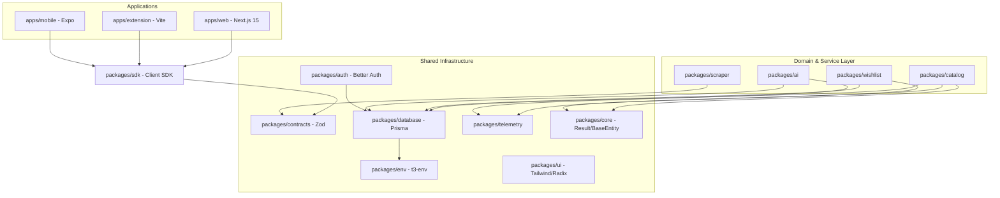
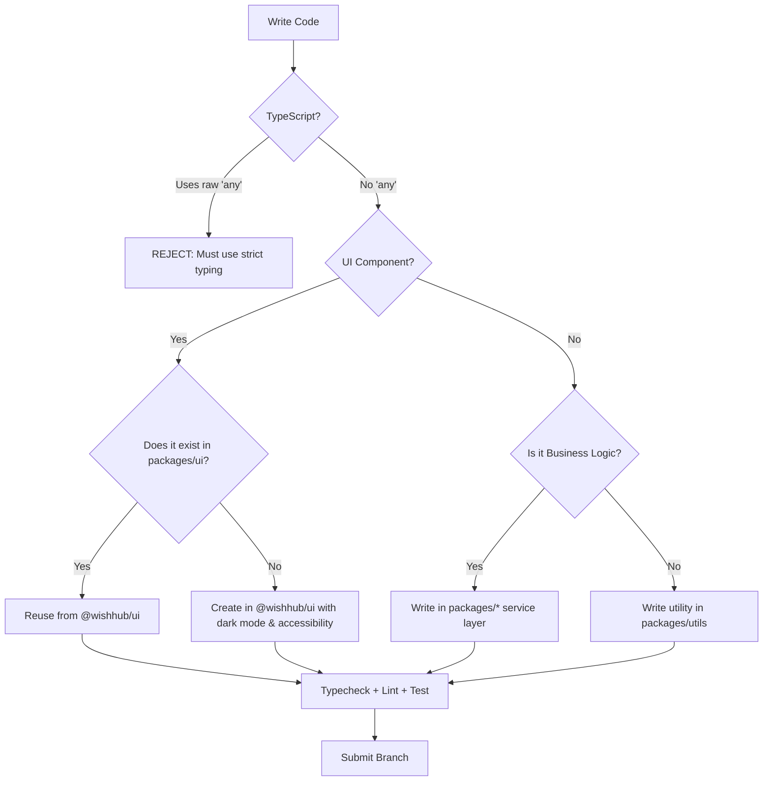
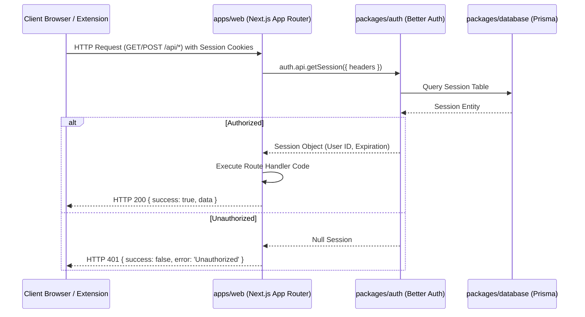
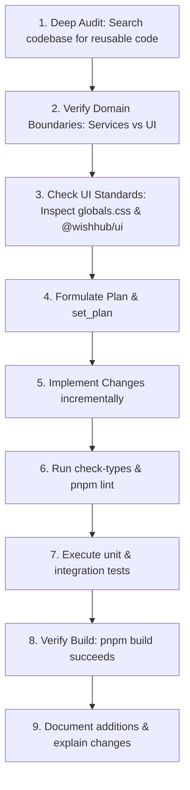

# WishHub AI Coding Agent Guidelines (`AI_AGENTS.md`)

This document is the absolute single source of truth for all AI coding agents (including Jules, Codex, Claude Code, Cursor, GitHub Copilot Agent, and Gemini CLI) and human engineers contributing to the WishHub repository.

It defines our architecture, coding conventions, testing standards, security rules, and workflows. Every AI agent must ingest and strictly adhere to this guide. Deviation from these principles will result in failed code reviews and rejected contributions.

---

## 1. Project Overview

### What is WishHub?
WishHub is a universal, multi-platform wishlist and product curation engine. It allows users to capture, organize, and curate product items from any merchant across the internet into beautiful, organized personal lists.

### Core Vision
To deliver a high-performance, design-centric, cross-merchant shopping list and curation experience that feels like a premium SaaS application (e.g., Apple, Linear, Vercel) rather than a generic utility.

### Primary Users
- **Curators & Shoppers**: Active online consumers who save items across hundreds of stores and require a unified dashboard.
- **Planners**: Users organizing lists for specific events (e.g., weddings, registries, holiday shopping).

### Current Maturity & Roadmap Stage
WishHub has graduated from Milestone 1 (simple saves) to **Milestone 2 (Multi-Wishlist System and Data Normalization)**.
- **Multi-Wishlist CRUD**: Fully implemented backend and frontend allowing dynamic list management and default lists.
- **Normalized Data Architecture**: Split user-specific associations (`SavedProduct`) from global, merchant-agnostic items (`CatalogProduct`) to enable single-scrape price sharing (ADR 003).
- **Current Milestone (Milestone 3 - Price Tracking)**: Moving towards cron-scheduled, single-scrape multi-user price tracking and automated alerts (ADR 004), supported by robust telemetry and structured AI analysis.

### Technology Stack & Justification
- **Next.js 15 (App Router)**: Hybrid Server/Client rendering for fast load times and SEO-friendly shared public wishlists.
- **Vite & Tailwind CSS**: Background-to-popup architecture for the high-efficiency Browser Extension.
- **Expo & React Native**: Universal codebase target for mobile devices (apps/mobile).
- **Prisma ORM & PostgreSQL (Supabase)**: Strongly typed database transactions and schema push migrations.
- **Better Auth**: Zero-trust session validation using Next.js route adapters and cookie transmission to the browser extension.
- **TanStack Query (React Query v5)**: Declarative data fetching, stale-while-revalidate caching, and robust optimistic UI updates.
- **Zod**: Runtime schema contracts shared across apps and packages via monorepo workspace references.
- **Framer Motion**: Fluid, layout-preserving page transitions and interactive micro-animations.

---

## 2. Architecture Overview

WishHub is organized as a Turborepo monorepo using pnpm. Code is strictly separated into focused applications and internal domain-centric packages under the `@wishhub` namespace.



### Data Flow Scenario: Saving a Product from the Extension
1. **Extraction**: The extension content script runs `@wishhub/scraper` parsers. It normalizes the canonical URL (e.g., extracts Amazon ASIN via `/dp/ASIN`).
2. **Duplicate Check**: The extension queries the local cache and API via `WishHubSDK` using the normalized canonical URL. If the user already saved it, the extension UI switches to "Already Saved".
3. **Save Dispatch**: The payload is validated with `@wishhub/contracts`'s `AddProductRequestSchema` and sent via `POST /api/products`.
4. **Service Execution**: `withApiHandler` authenticates the request. The thin route handler forwards the payload to `saveProductService` inside `@wishhub/catalog`.
5. **Catalog Lookup/Create**:
   - `CatalogRepository` checks if `CatalogProduct` exists for the canonical URL.
   - If not, a new `CatalogProduct` is created.
   - `SavedProductRepository` links the authenticated `userId` to the `CatalogProduct`.
   - The product is linked to the user's target `Wishlist` (or default wishlist if none is specified).
6. **Domain Events**: The service triggers any domain events (e.g., `ProductSavedEvent`), pulls them, and returns a successful `Result` DTO mapping.

---

## 3. Technology Stack

| Technology | Purpose | Core Standard |
| :--- | :--- | :--- |
| **Next.js 15 (App Router)** | Primary Web Delivery Mechanism & Backend REST API Router | Await `params` & `searchParams` in routes. Server Components by default. |
| **React 19** | Declarative Component Tree | Strict hook dependency arrays; no raw DOM manipulation. |
| **TypeScript** | Static Type Safety | No `any` allowlist. Explicit function signatures. Strict configurations. |
| **Tailwind CSS v3** | Styling Pipeline & Tokens | Shared styling via `@wishhub/ui`. Premium glassmorphism & gradients. |
| **Better Auth** | Authentication & Session Management | Unified adapters using `toNextJsHandler(auth)` and local SDK cookie propagation. |
| **Prisma ORM** | Schema-First DB Operations | Isolated within `packages/database`. Always inject transactional clients (`tx`). |
| **PostgreSQL (Supabase)**| Relational Datastore | Host system. Strict referential integrity. |
| **TanStack Query** | Client Data Caching | Optimistic state updates with rollback capability on deletion/mutation. |
| **Zod** | Bidirectional Contract Schemas | Source of truth in `packages/contracts`. All API inputs/outputs must be parsed. |
| **Framer Motion** | Micro-interactions | Controlled layout animations. No frame-blocking visual effects. |
| **Vite** | Browser Extension Builder | Build with styling post-processing checking. |
| **Playwright** | End-to-End & UI Verification | Automated tests for critical flows in `apps/web`. |
| **Vitest** | Fast Unit/Integration Testing | Isolated suite runner for utilities and scrapers. |
| **Turborepo & pnpm** | Monorepo Pipeline Orchestration | Caching task graphs. Define exact peer dependencies in workspaces. |

---

## 4. Directory Guide

### Workspaces Directory Map

#### `apps/web`
- **Purpose**: Main SaaS product portal, pricing, routing, settings, and backend REST endpoints.
- **Owner / Responsibility**: Next.js App Router layer. Handles routing, page presentation, and API handlers.
- **Key Files**:
  - `app/api/auth/[[...all]]/route.ts`: Catch-all auth.
  - `lib/api/handler.ts`: Centralized `withApiHandler` logging/telemetry wrapper.
  - `lib/api/responses.ts`: Custom `ApiResponse` formatting helpers.
- **Never Modify Lightly**: `lib/api/handler.ts` (affects global telemetry and response formatting).

#### `apps/extension`
- **Purpose**: Native chrome content extraction popup.
- **Owner / Responsibility**: Ultra-fast HTML extraction + offline queue worker.
- **Key Files**:
  - `src/background.ts`: Alarms, listener, and offline queue processor.
  - `src/lib/storage.ts`: Versioned local Chrome storage.
  - `verify-build.js`: Assures CSS bundle output to prevent unstyled popups.
- **Never Modify Lightly**: `src/background.ts` and `verify-build.js`.

#### `packages/database`
- **Purpose**: Schema and DB Client generation.
- **Owner / Responsibility**: Single-point repository mapping for PostgreSQL. No direct database access is allowed in apps/web without going through a Repository.
- **Key Files**:
  - `prisma/schema.prisma`: Schema database models.
  - `src/index.ts`: Database client initialization.
- **Never Modify Lightly**: `prisma/schema.prisma`.

#### `packages/contracts`
- **Purpose**: Contract-first architecture validation schemas.
- **Owner / Responsibility**: Houses all Zod Schemas shared between extension, mobile, and web.
- **Key Files**:
  - `src/index.ts`: Exports all API request/response schemas (e.g. `ExtractionResultSchema`).
- **Never Modify Lightly**: Shared request schemas (breaks backward compatibility).

#### `packages/ui`
- **Purpose**: SaaS visual design library.
- **Owner / Responsibility**: Shared React component tokens.
- **Key Files**:
  - `src/styles/globals.css`: Tailwind setup, CSS variables, and design tokens (`.premium-glass`).
- **Never Modify Lightly**: `src/styles/globals.css` and shared UI wrappers.

#### `packages/scraper`
- **Purpose**: Multi-store extractor algorithms.
- **Owner / Responsibility**: Normalizers, store adapters (e.g., Amazon), and fallbacks (JSON-LD, OG).
- **Key Files**:
  - `src/normalizers/index.ts`: tracking parameters removal & URL cleaning.
  - `src/core/index.ts`: orchestration layer.
- **Never Modify Lightly**: `src/normalizers/index.ts` (essential for duplicate detection integrity).

---

## 5. Coding Standards



### General Rules
1. **Never Duplicate Components**: Before building any interface elements, verify if it can be composed using shadcn/radix primitives in `@wishhub/ui`.
2. **Reuse UI**: Import Button, Input, Card, empty states, and layout drawers exclusively from `@wishhub/ui` inside both the `apps/web` and `apps/extension` apps.
3. **Composition Over Inheritance**: Always build flexible components with React children composition. Do not create complex prop-based rendering configurations.
4. **Strict Typing**: Ensure `"strict": true` in `tsconfig.json`. No `any` type is allowed unless parsing external untrusted payloads inside Zod boundaries.
5. **Separation of Concerns**:
   - **UI Pages**: Clean, layout-only rendering.
   - **Route Handlers**: Fat-free entry routes. Simply authenticate, validate via Zod, and delegate to services.
   - **Services**: All calculations, validation checks, transaction handling, and domain event dispatching.
   - **Repositories**: Pure SQL queries and CRUD mappings via Prisma. No business logic inside repositories.

---

## 6. Database Rules

### The Prisma Source of Truth
`packages/database/prisma/schema.prisma` is the absolute schema design authority. Do not create auxiliary schemas or run raw DDL scripts on PostgreSQL manually.

### Workflow & Evolution
- **Development**: Use `pnpm db:push` inside packages/database during local iterations.
- **No `prisma/migrations` Folder**: Since Schema Push is our active workflow, we do not generate step migrations.
- **Prisma Client Generation**: Generating the client is a prerequisite to compiling the monorepo. It must be generated using `pnpm db:generate` before running builds.

### Production Deployments
Deployments to production target Supabase PostgreSQL.
- Schema changes are synchronized using automated schema sync tools or `pnpm db:push` in CI/CD pipeline triggers (where safe and non-breaking).
- **Zero-Downtime Rule**: Never perform breaking database changes. If renaming a column is necessary:
  1. Add the new column.
  2. Double-write to both columns.
  3. Run a database backfill script.
  4. Change reads to use the new column.
  5. Delete the legacy column in a subsequent release.

---

## 7. Authentication Rules

WishHub employs Better Auth for secure, stateless session tracking.

### Architecture Flow



### Implementation Guidelines
- **Route Protection**: Wrap Next.js App Router handlers with `withApiHandler` to check sessions automatically.
- **Session Lookup**: Always use `auth.api.getSession` with forwarded request headers:
  ```typescript
  const session = await auth.api.getSession({ headers: req.headers });
  ```
- **Cookie Setup**: Ensure session cookie propagation in cross-origin environments (e.g. extension querying NextJS API). Set correct CORS options and domain matching settings.
- **Environment Variables**:
  - `BETTER_AUTH_SECRET`: Master signature salt. Must be securely rotated and kept secret.
  - `BETTER_AUTH_URL`: Full base domain URL of the deployed application.

---

## 8. API Standards

All endpoints are standardized REST interfaces. They must handle parsing, logging, pagination, and error mapping uniformly.

### Request Validation
Every POST, PUT, and PATCH endpoint must parse the incoming request body using a Zod schema from `@wishhub/contracts`:
```typescript
const body = await req.json();
const validated = CreateWishlistRequestSchema.safeParse(body);
if (!validated.success) {
  return ApiResponse.badRequest('Validation Failed', validated.error);
}
```

### Standardized Response Formatting
All REST endpoints in `apps/web` must use shared helpers in `lib/api/responses.ts` to return consistent JSON:

#### Success Response (HTTP 200/201)
```json
{
  "success": true,
  "data": {
    "id": "clt123456",
    "name": "My Travel Gear"
  }
}
```

#### Failure Response (HTTP 400/401/403/404/500)
```json
{
  "success": false,
  "error": {
    "code": "UNAUTHORIZED",
    "message": "Authentication is required to perform this action."
  }
}
```

### Pagination Protocol
When returning lists, implement offset-based cursor pagination via parameters `limit` (default 20, max 100) and `cursor`:
- Validate using `PaginationSchema`.
- Always return a `nextCursor` key on successful list responses to support infinite loading cards.

---

## 9. UI Standards (SaaS Redesign Vision)

WishHub looks and feels like a modern SaaS product (inspired by Apple, Linear, and Vercel). We enforce generous whitespace, subtle shadows, and premium layout transformations.

### Custom Design Tokens
Avoid raw inline styles and arbitrary Tailwind configurations. Utilize the custom design tokens defined in `@wishhub/ui/src/styles/globals.css`:
- **Gradients**: Use `.premium-gradient-text` for headings (`bg-gradient-to-r from-neutral-900 via-neutral-600 to-neutral-900`).
- **Glassmorphism**: Use `.premium-glass` for overlay dialogs, navbar backgrounds, and hover indicators (`backdrop-blur-xl bg-white/75 border-neutral-200/50`).
- **Elevation**: Use `.premium-shadow` for card lifts.
- **Corners**: Use generous rounded edges (`rounded-2xl` and `rounded-3xl`). Do not use harsh 90-degree boxes.

### Light and Dark Parity
Every component must be checked for readability and styling in both light and dark backgrounds. Support dark styles dynamically:
- Primary Text: `text-neutral-900 dark:text-neutral-50`.
- Backgrounds: `bg-white dark:bg-neutral-950`.
- Borders: `border-neutral-200/40 dark:border-neutral-800/40`.

---

## 10. AI Standards

AI analysis (generating product summaries, pros/cons, rating verification, categorization) resides in the standalone package `packages/ai`.

### Provider Abstraction Model
Do not couple product parsing or analysis code with specific AI vendor libraries. All AI interaction must route through the `AIProvider` contract interface:
```typescript
export interface AIProvider {
  name: string;
  generateInsight(product: ProductInput, promptText: string): Promise<ProviderResult>;
}
```

### Standard Implementations
- **MockAIProvider**: Enabled by default during development, tests, and CI pipelines via `AI_PROVIDER=mock`. Generates deterministic summaries using a string-hash function based on the product title.
- **OpenAIProvider**: Utilized in production environment routes (`AI_PROVIDER=openai`). Calls `gpt-4o-mini` with structured JSON output formatting.

### Cost Awareness & Rate Limiting
- **Structured Outputs**: Always invoke OpenAI models with `response_format: { type: 'json_object' }` and validate outputs using `AIInsightSchema` in `packages/ai/src/types.ts` to prevent parsing exceptions and reduce token-wasting failures.
- **Token Estimator**: The OpenAIProvider computes token consumption and tracks execution pricing dynamically (`estimatedCost`), writing these metrics directly to the `AIJob` logging schema.

---

## 11. Browser Extension Rules

The Browser Extension (`apps/extension`) is constructed with React, Vite, and tailwind styling. It is built as a highly responsive single-page popup paired with a background service worker.

### Scraping Pipeline Flow
- Scraping operates inside the context script, utilizing parsing rules from `@wishhub/scraper`.
- Raw metadata extracted from the document DOM is normalized immediately using `@wishhub/scraper`'s `normalizeUrl` utility before transmitting it to the extension popup, preventing tracking parameter leaking and duplicates.

### Versioned Local Cache
The extension uses `chrome.storage.local` with standard stale-while-revalidate protocols:
- **Wishlist Cache**: Retains wishlist structures locally (TTL = 5 minutes) to ensure instantaneous launch times (<200ms).
- **Offline Save Queue**: If a network connection is lost, saved items are queued in `offlineQueue` storage.
- **Sync Processor**: The background script (`src/background.ts`) listens to connection changes or periodic alarms (`retry-offline-queue`) to retry queued operations sequentially.

---

## 12. State Management

WishHub utilizes a decentralized caching strategy with clear boundaries between server-driven models and UI-controlled client instances.

### TanStack Query Rules
- **Server Caching**: Never write persistent global state machines (like heavy custom Redux boilerplate) for server data. Use TanStack Query hooks to fetch database models.
- **Optimistic UI Updates**: Instantly remove, rename, or update items locally upon triggering mutations:
  1. Save previous state.
  2. Inject temporary optimistic payload.
  3. If API reports failure, rollback UI seamlessly to previous state.
  4. Force invalidate and re-fetch background keys upon mutation settle.

### React State Management
- For UI configurations, controlled checkboxes, open drawer toggles, and modal states, use basic React `useState`.
- For layout-wide non-persistent configurations (such as user preferences, dashboard filters, and search inputs), employ thin Zustand stores.

---

## 13. Testing Standards

We maintain a high-coverage test suite across packages and applications, detailed in `docs/TESTING.md`.

### Unit Testing (Vitest)
Used for checking core algorithms, normalizers, mock providers, and validation schemas.
- Run tests: `pnpm test`.
- All normalizers and scraping adapters must have explicit unit test files in a local `__tests__` directory.

### UI & Integration Testing (Playwright)
Used for critical user journeys (e.g., creating accounts, adding products, custom sorting).
- Write automated Playwright automation scripts before launching new interactive features on `apps/web`.

### Mocking Strategy
- Do not make HTTP requests to external third-party servers inside testing environments.
- Use MSW (Mock Service Worker) for API intercepting, or mock network wrappers inside your test blocks.

---

## 14. Performance Rules

WishHub delivers premium client responsiveness and aims for Lighthouse scores >= 90.

### Render Budgets & Optimization
- **Next.js Image Optimization**: Always use the `<Image />` component with configured aspect-ratio tags. Avoid raw unoptimized `` elements.
- **Dynamic Imports**: Lazy load complex components, such as multi-store graphing elements or administrative dashboard panels, using `next/dynamic`.
- **Memoization**: Wrap expensive DOM calculation transformations in `useMemo` and event handlers in `useCallback` to prevent unnecessary component re-renders.
- **Suspense Boundary Protection**: Wrap search-linked URL components and async-loaded pages in `<Suspense fallback={...}>` to prevent complete hydration blockouts and NextJS compilation failures.

---

## 15. Security Rules

### Secret Hygiene
- **Never commit production `.env` files** to Git.
- Maintain `.env.example` as the single source of truth for required workspace environment configurations.
- Use the central validation helper in `@wishhub/env` using `@t3-oss/env-nextjs` to catch missing secrets instantly during builds.

### Data Protection & Input Checks
- **Never Trust Client User IDs**: Ensure that the user ID resolved inside API endpoints is always derived directly from the authenticated session, rather than trusted from parameter payloads.
- **XSS Mitigation**: Sanitize all scraped merchant content, including HTML product descriptions and merchant comments, before dangerously injecting HTML into the DOM.
- **CSRF Protection**: Better Auth manages CSRF prevention automatically. Ensure CORS headers on route APIs are constrained explicitly to trusted domains.

---

## 16. Deployment Workflow

Deployments are fully automated via Vercel integration and workspace task caching.

### Web Deployment (Vercel)
- The root build pipeline triggers a Vercel deployment of `apps/web`.
- The build script first generates the Prisma client and validates environment parameters before executing `next build`:
  ```bash
  pnpm --filter @wishhub/database db:generate && next build
  ```

### Directory Build Validation
- **Extension Compilation**: Vite bundles assets to `apps/extension/dist`.
- **Build Verification**: The verification script `verify-build.js` validates that Tailwind styles compile correctly into CSS files, preventing unstyled browser extension popups.

---

## 17. AI Agent Workflow

Every AI coding agent must follow this exact sequence when tackling an issue, bug, or feature request:



### 11-Step Checklist
1. **Audit Existing Code**: Search the workspace for any duplicate code. Check `@wishhub/ui` for existing cards or buttons, and `@wishhub/utils` or feature repositories before creating new files.
2. **Review DB Models**: Inspect `schema.prisma` and check if structural changes are needed.
3. **Draft Plan**: Draft a step-by-step numbered plan and call the `set_plan` tool.
4. **Implement Incrementally**: Avoid massive single-file rewrites. Implement, read, and verify your changes incrementally.
5. **Enforce Type Safety**: Verify TypeScript compiler output on every workspace you modify.
6. **Lint Code**: Ensure no ESLint rules are disabled or bypassed using comment annotations.
7. **Run Tests**: Verify existing tests pass and write new tests for any added business logic.
8. **Verify UI & Accessibility**: If UI changes are made, ensure proper dark/light mode visibility, Radix-compliant focus management, and responsive layouts.
9. **Build the Workspace**: Run `pnpm build` at the repository root to ensure nothing is broken.
10. **Document Changes**: Update README, architecture notes, or API docs if schemas or options were added.
11. **Submit**: Request review or commit using Git-friendly branch structures.

---

## 18. Repository Search Checklist

Before creating a component, utility, or business module, search the repository using the following keyword mapping to find existing code:

| What you want to create | Search Term / Workspace to inspect | Alternative to reuse |
| :--- | :--- | :--- |
| Custom Button or Icon wrapper | `packages/ui/src/components/button.tsx` | `@wishhub/ui` `Button` |
| Text Field, Password, Select box | `packages/ui/src/components/input.tsx` | `@wishhub/ui` `Input` |
| Product Display Layout or Card | `packages/ui/src/components/card.tsx` | `@wishhub/ui` `Card` |
| Modal popup or Slide-out Drawer | `packages/ui/src/components/dialog.tsx` | `@wishhub/ui` `Dialog` |
| Text or URL normalization utility | `packages/scraper/src/normalizers/` | `normalizeUrl` utility |
| Custom Database access logic | `packages/wishlist/src/repository/` | `WishlistRepository` / custom repositories |
| Loading Skeleton placeholder | `packages/ui/src/components/skeleton.tsx` | `@wishhub/ui` `Skeleton` |
| Shared Zod Interface or Schema | `packages/contracts/src/index.ts` | Shared contract schema types |

---

## 19. Common Architectural Pitfalls to Avoid

- ❌ **Duplicate Components**: Creating a custom component inside `apps/web/components` that duplicates an existing control inside `@wishhub/ui`.
- ❌ **Direct Database Access inside Web Routes**: Importing the Prisma DB client directly inside an API route handler instead of routing operations through a dedicated repository.
- ❌ **Bypassing Zod Validation**: Accepting arbitrary parameters inside POST endpoints without validation using schemas from `@wishhub/contracts`.
- ❌ **Skipping Authentication**: Exposing stateful user routes without wrapping them with `withApiHandler` or checking the Better Auth session context.
- ❌ **Mock vs OpenAI Code Coupling**: Hardcoding OpenAI-specific parameter models inside business service workflows instead of routing requests through `AIProviderFactory`.
- ❌ **Failing to await params**: Accessing properties of Next.js App Router parameters directly without awaiting them, which fails Next.js 15 production builds.
- ❌ **Unstyled Browser Popups**: Forgetting to process or import styling parameters, which causes Vite to skip styling asset compilation.

---

## 20. Future Roadmap & Upcoming Milestones

Derived directly from existing code placeholders, ADR proposals, and pending features in the codebase:
- **Scheduled Automated Scraping (ADR 004)**: Moving from on-demand scraping to centralized schedulers and background dispatcher cron jobs (`TrackingJob` execution).
- **Price Alert Delivery Pipeline**: Integrating user price alert subscriptions with notification systems (Firebase Cloud Messaging, FCM environment placeholders).
- **Public Wishlist Sharing**: Implementing secure, public-facing read-only routes for non-authenticated browsers using dynamic SEO tag configurations.
- **Enhanced Categorization Models**: Enhancing `packages/ai` to categorize items automatically using standard taxonomic rules.

---

*This guide is a living document. It must evolve alongside WishHub. Whenever architecture, workflows, or standards change, update this document immediately to keep future AI agent runs perfectly synchronized.*
