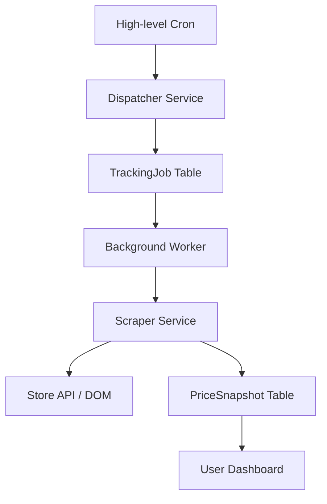

# Milestone 3: Price Tracking & Price History — Technical Specification

## 1. Executive Summary
This document outlines the architecture for the WishHub Price Tracking subsystem. The primary goal is to provide users with real-time price monitoring and historical analysis while maintaining extreme scalability through a "single-scrape, many-users" execution model.

## 2. Domain Model & Entities

### Core Entities
- **Store**: Represents an e-commerce platform (e.g., Amazon US, eBay).
    - `id`, `name`, `domain`, `logoUrl`, `country`, `currency`, `status` (ACTIVE, BLOCKED).
- **CatalogProduct**: Global source of truth for a product listing.
    - `id`, `storeId`, `externalId` (ASIN/SKU), `canonicalUrl`, `title`, `description`, `lastScrapedAt`.
- **Variant**: Specific SKU within a product listing (e.g., Size: L, Color: Blue).
    - `id`, `catalogProductId`, `externalId`, `name`, `lastScrapedAt`.
- **PriceSnapshot**: Immutable point-in-time record of product data.
    - `variantId`, `price`, `currency`, `seller`, `shipping`, `stockStatus`, `availability`, `capturedAt`.
    - *Metadata*: `adapter`, `confidence`, `responseTime`, `scrapeVersion`.

### Subscription & Execution
- **TrackedProduct**: A user's subscription to a specific `Variant`.
    - `userId`, `variantId`, `notifyOnDrop`, `targetPrice`, `checkFrequency`, `status` (ACTIVE, PAUSED).
- **TrackingJob**: Operational record for a scraper task.
    - `id`, `catalogProductId`, `scheduledAt`, `startedAt`, `finishedAt`, `status` (PENDING, RUNNING, COMPLETED, FAILED, RETRYING), `attempts`, `lastError`.

## 3. Database Design (Prisma)
- **Indexing**:
    - `PriceSnapshot`: Index on `(variantId, capturedAt DESC)` for fast history retrieval.
    - `TrackingJob`: Index on `(status, scheduledAt)` for efficient dispatcher polling.
- **Constraints**:
    - `Store.domain`: Unique.
    - `CatalogProduct`: Unique on `(storeId, externalId)`.
    - `TrackedProduct`: Unique on `(userId, variantId)`.
- **Retention**: Snapshot deduplication logic saves records only on change or 24-hour heartbeat.

## 4. Execution Architecture

### Scheduler Logic
- **Dispatcher**: Identifies products due for refresh based on `nextCheckAt` (calculated from `checkFrequency`).
- **Retry Policy**: Exponential backoff (5m -> 30m -> 2h -> 12h) before marking as FAILED.
- **Dynamic Intervals**: "HOT" products (fast changing) vs "LOW" products (stable/discontinued).

## 5. Service Layer (DDD)
- **SubscriptionService**: Manages user tracking preferences and CRUD operations on `TrackedProduct`.
- **JobDispatcherService**: Core logic for queuing global price checks.
- **PriceRecordingService**: Logic for scraper execution, metadata capture, and snapshot deduplication.
- **AnalyticsService**: Aggregates snapshots for stats (Avg Price, All-time Low, % Drop).

## 6. API Design (REST)
- `GET /api/tracking`: List active subscriptions.
- `POST /api/tracking`: body `{ variantId, preferences }`.
- `GET /api/tracking/:id`: Subscription details + current price stats.
- `PATCH /api/tracking/:id`: Update alerts/frequency.
- `DELETE /api/tracking/:id`: Stop tracking.
- `GET /api/tracking/:id/history`: Time-series data points.

## 7. UX Design

### Dashboard
- **Grid View**: Mini sparkline graphs on each product card showing 7-day trend.
- **Detail View**: Interactive charts (7d/30d/90d/1y/All), "Price Drop" badges, and "Last Checked" timestamps.
- **Metrics**: Current Price, Lowest, Highest, Average, Tracking Duration.

### Extension
- **Status Overlay**: Injected badge showing "✓ Tracking" on active pages.
- **Save Popup**: "Track Price" toggle with immediate feedback on tracking status and current low price.

## 8. Performance & Scale
- **Storage**: JSON metadata in snapshots for future-proofing without schema bloat.
- **Caching**: API-level caching for `/history` endpoints with invalidation on new snapshot creation.
- **Concurrency**: Dispatcher ensures exactly one active job per product to prevent rate-limiting.

## 9. Risks & Mitigations
- **Scraper Fragility**: DOM changes break price extraction. *Mitigation*: Multi-source extraction (JSON-LD + DOM) and confidence-based alerting.
- **Anti-Bot Blocking**: Aggressive scraping leads to IP bans. *Mitigation*: Jittered scheduling, proxy support placeholder, and "soft-fail" job states.
- **Data Bloat**: Snapshot table grows exponentially. *Mitigation*: Aggressive deduplication and monthly archival/partitioning.
- **User Abuse**: Tracking 1000s of products on free tier. *Mitigation*: Quotas per user tier.

## 10. Zod Contract Designs (Draft)
- **TrackProductSchema**: `id`, `variantId`, `preferences: { notifyOnDrop: boolean, targetPrice: number | null }`, `status`.
- **PriceSnapshotSchema**: `id`, `variantId`, `price`, `currency`, `timestamp`, `metadata: Record<string, any>`.
- **PriceHistorySchema**: `variantId`, `stats: { min: number, max: number, avg: number }`, `points: Array<{ timestamp, price }>`.
- **TrackingStatusSchema**: `enum: [ACTIVE, PAUSED, BLOCKED, DISCONTINUED]`.

## 11. 10-Phase Roadmap
1.  **Database & Contracts**: Schema migrations and Zod validation.
2.  **Repositories**: Data access layer for Jobs and Snapshots.
3.  **Business Services**: Core logic for subscription management and snapshot recording.
4.  **REST APIs**: Endpoint implementation and ownership verification.
5.  **Dashboard UI**: Core "Tracked" grid and basic lists.
6.  **Browser Extension Integration**: Tracking toggle and status indicators.
7.  **Dispatcher & Workers**: Dispatcher logic and background worker integration.
8.  **Advanced Visualization**: Charts, Sparklines, and Metrics widgets.
9.  **Performance & Optimization**: Cache layer and archival jobs.
10. **Production Hardening & Release**: Final audit and v1.1 deployment.
