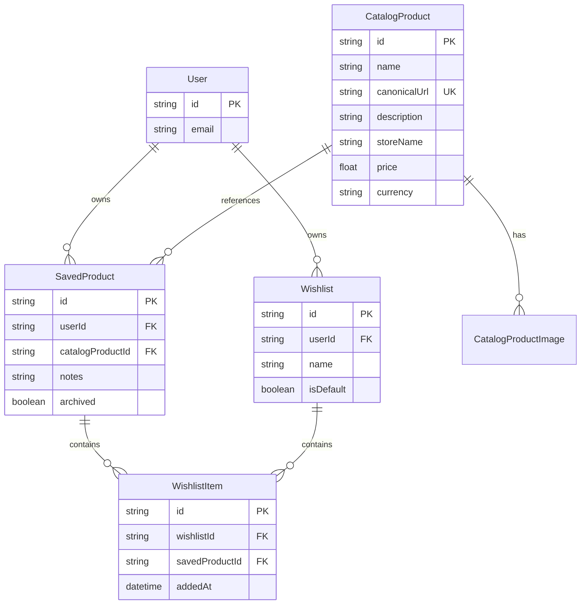

# Database Schema & Architecture

## Overview
WishHub uses Prisma with a PostgreSQL (Supabase) backend. The schema is designed to separate global product data from user-specific interactions.

## Entity Relationship Diagram

## Design Rationale
- **Catalog vs. Saved**: Products are first identified by their canonical URL in the `CatalogProduct` table. When a user saves a product, we link a `SavedProduct` record to the global catalog entry. This allows us to track price history and product metadata globally while keeping user notes and wishlist associations private.
- **Normalization**: Centralized store names and currencies ensure consistent filtering across the platform.
- **Indexing**:
    - `CatalogProduct.canonicalUrl`: Unique index for fast duplicate detection.
    - `SavedProduct.userId`: Index for fast dashboard loading.
    - `WishlistItem(wishlistId, savedProductId)`: Composite unique index to prevent duplicate items in the same wishlist.
