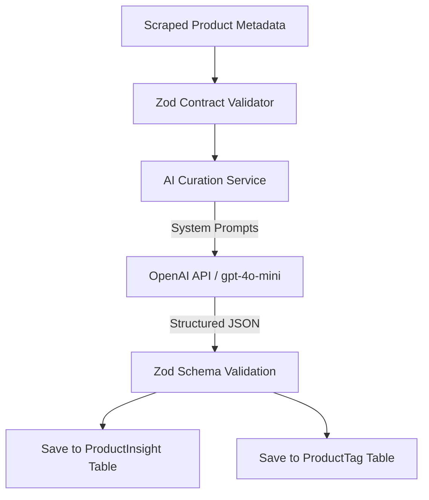

# AI Strategy

## 1. Unified AI Assistant Workflow
The AI Strategy centers on providing intelligent product curation, alternative recommendations, price predictions, and automated categorization.

---

## 2. Intelligently Scoped Prompts & Cost Controls
To keep operating costs low while maintaining high accuracy, we combine two approaches:
- **Heuristics First**: Use local regex matching and deterministic rules for simple tagging, categorization, and brand identification, completely bypassing the LLM for straightforward tasks.
- **Structured JSON Models**: When utilizing models like `gpt-4o-mini` for advanced tasks (e.g., generating pros/cons, rating verification, category sorting), enforce structured JSON output formatting. This prevents parsing exceptions, minimizes input/output tokens, and keeps costs predictable.

---

## 3. Multimodal & Visual Search Roadmap
- **Visual Similarity Engine**: Generate embeddings for product images using model pipelines like **CLIP** or **resnet50**, and store these embeddings in our vector database. This allows users to find visually similar alternatives for out-of-stock items.
- **Context-Aware Recommendations**: Leverage user curation histories to generate personalized, context-aware suggestions (such as "Accessories frequently saved with this travel backpack") while protecting user privacy.
