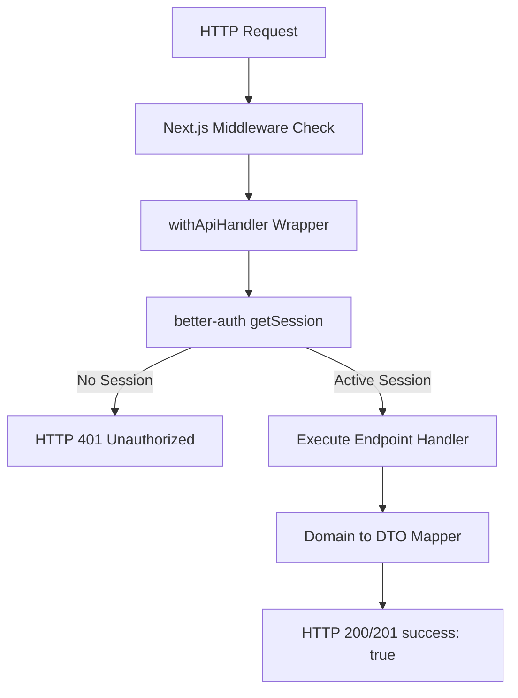

# API Audit

## 1. REST Compliance & Consistency
The REST endpoints are defined under `apps/web/app/api/`.

### Route Pattern Analysis

```
GET/POST /api/products          # Product lists and creation
GET/POST /api/wishlists         # Wishlist lists and creation
```

- **REST Compliance Rating**: `8.5 / 10`
- **Assessment**: The route structure is logical and matches REST best practices. However, the legacy save endpoint (`POST /api/products`) returns an inconsistent response format compared to newer endpoints. It returns `{ product, duplicate }` directly, bypassing the standardized `{ success: true, data }` wrapping format defined in `lib/api/responses.ts`.

---

## 2. API Security, Rate Limiting & Auth Verification



### Risk: Missing Rate Limiting
- **Observation**: There is no rate limiting middleware in `apps/web/app/api` routes or Next.js layout structures. This exposes public endpoints to scraping, brute-force attacks, and elevated server load.
- **Remediation**: Add a global Next.js edge-middleware rate limiter using `@upstash/ratelimit` or custom Redis rate-limiters.

### Session Context Forwarding
- Auth context verification in `apps/web/lib/api/handler.ts` successfully extracts the active user ID from the validated session.
- The user ID is correctly injected directly into downstream services, preventing client ID spoofing attacks.

---

## 3. Caching & Performance
- **GET /api/products**: Currently performs database joins on every query without server-side caching. This works fine for lower traffic volumes but could become a performance bottleneck at scale.
- **GET /api/auth/get-session**: Frequently called by the browser extension. These session verification requests must be fast to ensure the extension popup loads in under 200ms. We should optimize session responses using HTTP Cache-Control headers where appropriate.
