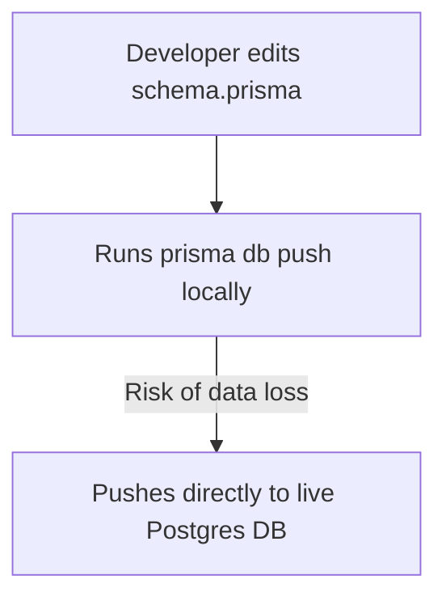

# Architectural Improvements

## 1. Domain Modeling & DDD Separation
While WishHub implements decoupled service domains (such as `@wishhub/wishlist` and `@wishhub/catalog`), certain parts of the application would benefit from cleaner architectural separation.

### Proposed Improvement: Decouple Prisma Client types from domain models
- **Why it matters**: Domain models often return direct Prisma client types, leaking ORM dependencies into outer application layers.
- **Current Implementation**: Database repositories (such as `packages/wishlist/src/repository/wishlist.repository.ts`) return instances of Prisma-generated models.
- **Proposed Improvement**: Map Prisma database records to explicit domain entities inside the repository layer, returning pure domain models to services.
- **Impact**: Fully decouples domain logic from database engines and ORM frameworks.
- **Effort**: Medium (3 days) | **Risk**: Medium

---

## 2. Database Migration Workflow Transition
WishHub currently relies on `prisma db push` inside its development pipeline, which lacks a historical record of schema changes.

### Proposed Improvement: Migrate from db push to formal Prisma migrations
- **Why it matters**: Pushing schema changes directly to production databases (e.g. Neon) without generating and verifying migration scripts presents significant data loss risks.
- **Current Implementation**: Schema changes are pushed directly using `prisma db push`.
- **Proposed Improvement**: Generate formal migration script files (`prisma migrate dev`) during local development and run these migrations as a step in the deployment pipeline.
- **Impact**: Provides a history of schema changes and guarantees safe, reproducible database deployments.
- **Effort**: Medium (2 days) | **Risk**: High (Requires careful execution to avoid data loss on existing tables).
