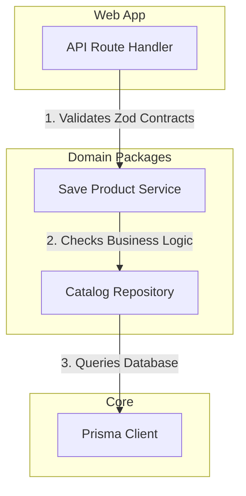

# Architecture Audit

## 1. Domain-First Review (DDD Compliance)
WishHub claims a strict Domain-Driven Design (DDD) model, aiming for framework-agnostic services and domain logic.

```
packages/wishlist/src/
├── domain/
│   └── models.ts       # Domain primitives
├── repository/
│   └── wishlist.repository.ts
└── services/
    └── create-wishlist.service.ts
```

### Strengths
- **Thin UI Controllers**: The UI views and route controllers contain minimal logic. They parse request inputs and delegate executing steps to decoupled domain service classes.
- **Domain Primitives (`BaseEntity`, `Result`)**: The application uses a unified domain model (`packages/core/src/index.ts`) for transaction results, avoiding the use of global try-catch frameworks to handle business errors.

### Vulnerabilities & Architectural Flaws
1. **Domain Model Leakage**:
   - The domain models inside `packages/wishlist/src/domain/models.ts` expose their properties directly. In a true DDD system, domain aggregates protect state invariants through explicit state transition methods.
2. **Missing Transaction Context**:
   - The repositories (e.g. `packages/wishlist/src/repository/wishlist.repository.ts`) support an optional transaction client parameter `tx`. However, the services often invoke multiple repository calls without wrapping them in a database transaction block, leading to potentially inconsistent database states if an intermediate step fails.

---

## 2. Package-by-Package Quality Audit

### `apps/web`
- **Architectural Score**: `8.0 / 10`
- **Review**: Clean App Router configuration. However, some legacy routes (e.g., `apps/web/app/api/products/route.ts`) have duplicated validation, bypassing the unified `withApiHandler` pipeline.

### `apps/extension`
- **Architectural Score**: `8.5 / 10`
- **Review**: Highly optimized. The separation of `content.ts` (DOM reading), `background.ts` (offline synchronization), and popup React components is outstanding.

### `packages/contracts`
- **Architectural Score**: `9.5 / 10`
- **Review**: Excellent design. This is the single source of truth for contract validation schemas, preventing mismatch bugs between the extension and web layers.

### `packages/database`
- **Architectural Score**: `7.5 / 10`
- **Review**: Exposes a Prisma wrapper. The database models lack an explicit abstraction layer, which leaks Prisma-specific client types into outer domain services.

### `packages/scraper`
- **Architectural Score**: `9.0 / 10`
- **Review**: Modular design. The plugin pattern allows developers to write decoupled adapters for individual merchant platforms (e.g., Amazon) without modifying the scraper core orchestrator.

---

## 3. Monorepo Quality Register



- **Violation of DRY (Don't Repeat Yourself)**:
  - There is duplicate URL parsing and normalization code in both the content script scraper execution layer and the server-side save product service router. These logic flows must be fully consolidated inside `@wishhub/scraper/normalizers`.
- **Violation of SOLID**:
  - `ScraperCore` registers default adapters inside its class constructor, violating the Open-Closed Principle. Adapters should instead be registered dynamically through external dependency injection.
