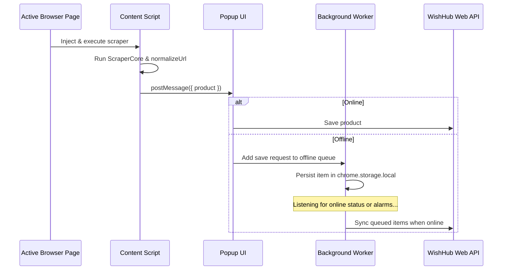

# Extension Audit

## 1. Extension Runtime Architecture
The browser extension (`apps/extension`) is constructed with React, Vite, and tailwind styling. It uses a clean separation of concerns:
- **`content.ts`**: Direct page DOM extractor script.
- **`background.ts`**: Event-driven worker that runs in the background. It manages alarms, connection listeners, and the offline synchronization queue.
- **Popup UI**: Fast React interface that renders extracted data and allows saving items.

---

## 2. Scraping & Normalization Protocol

### Risk: Duplicate Scraping Runs
- **Observation**: Scraping occurs when the user opens the extension popup on an active product page. If the DOM structure is complex, executing multiple scraping runs on a single tab can impact browser performance.
- **Remediation**: Cache the extraction result inside `chrome.storage.local` keyed by the tab URL. This avoids re-scraping the page if the user closes and reopens the popup on the same tab.

---

## 3. Storage & Offline Synchronization
- **Queue Implementation**: The offline queue worker in `background.ts` handles network failures gracefully by storing pending saves in `chrome.storage.local`.
- **Synchronization Risk**: Alarms are scheduled to run periodically to retry failed sync requests. If a save request fails due to an invalid product payload (e.g., a schema validation error) rather than a network disconnect, the extension will continuously retry the request, potentially flooding the server with invalid API calls.
- **Recommendation**: Set a maximum retry limit (e.g. `attempts < 3`) for individual queued items. If an item exceeds this limit, mark it as failed and prompt the user to review or discard it.
