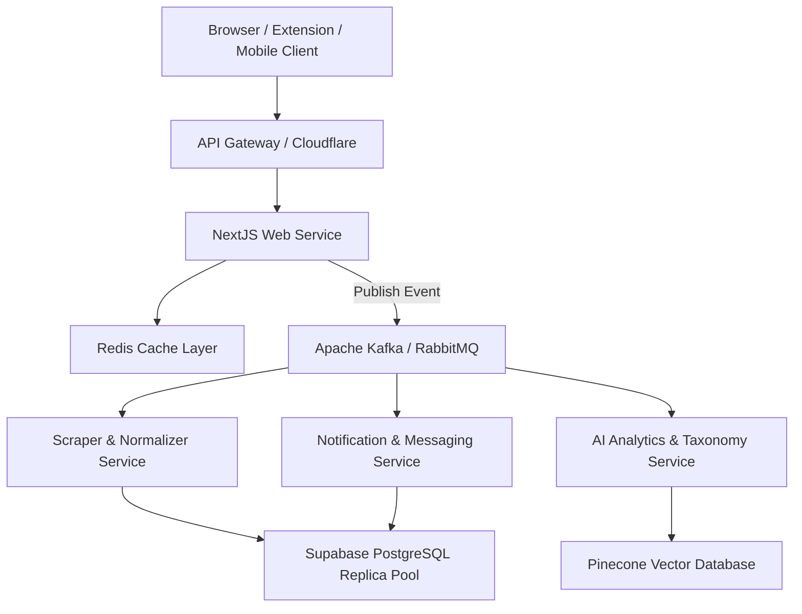

# Long-Term Architecture (3-Year Plan)

## 1. Modular Monolith to Event-Driven Microservices
While a modular monorepo (monolith) is highly efficient for MVP validation, scaling to millions of users will require transitioning to a hybrid, event-driven microservices architecture.

---

## 2. Distributed Caching & Task Queues
- **Redis Replication**: Deploy Redis clusters across target regional Edge nodes to cache user sessions and frequently accessed public wishlist details, minimizing database read operations.
- **Robust Task Worker Queues**: Migrate background operations (such as scheduling scrapers or sending alerts) to event-driven processing frameworks like **BullMQ** or **Temporal**. This guarantees reliable, transactional execution with built-in retry logic.

---

## 3. Search, Vector Indexing, & AI Recommendations
- **Semantic Product Search**: Store product description embeddings inside a vector database like **Pinecone** or PostgreSQL with **pgvector**. This enables semantic search, visual similarity matching, and automatic alternative product recommendations.
- **AI Taxonomy Engine**: Deploy background workers to automatically tag, clean, and categorize catalog items into a standardized taxonomy, keeping search indexes clean and accurate.
