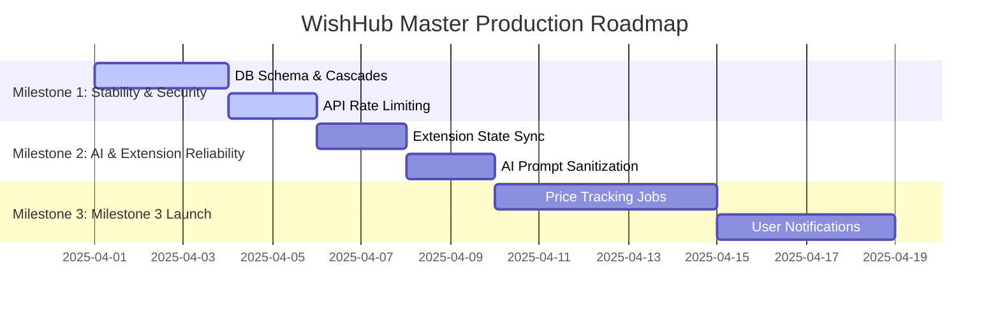

# Master Execution Roadmap

## 1. Roadmap Strategy (ROI Matrix)
This execution roadmap is designed to maximize development ROI, focusing on fixing critical security and scalability gaps first before building complex new features.

---

## 2. Milestone 1: Core Stability & Security (Blockers)
- **Goal**: Secure and stabilize the core database and API layers to prepare for high traffic.
- **Deliverables**:
  - Update `schema.prisma` to add missing foreign key cascades and database indexes.
  - Add Next.js Edge middleware rate limiting to intercept and throttle requests on public API routes.
  - Implement unified API response formatting on all legacy routes.
- **Complexity**: Low
- **Risk**: Low (Requires careful execution of schema updates to avoid data loss).
- **Acceptance Criteria**:
  - `pnpm build` and `pnpm test` pass.
  - Deleting a product successfully cascades to delete its associated wishlist items.
  - API requests exceeding 100 requests/minute receive an HTTP 429 rate limit response.

---

## 3. Milestone 2: AI & Extension Reliability
- **Goal**: Secure AI prompt pipelines and fix extension state sync issues.
- **Deliverables**:
  - Add input validation and prompt sanitization to `packages/ai` to prevent prompt injection.
  - Implement a stale-while-revalidate caching layer with TTL validation in the browser extension popup.
  - Enforce a maximum retry limit on the extension's background sync queue to prevent sync loops.
- **Complexity**: Medium
- **Risk**: Low
- **Acceptance Criteria**:
  - Extracted metadata is verified and sanitized before formatting system prompts.
  - The extension popup loads cached data instantly (<200ms) and triggers background refreshes seamlessly.

---

## 4. Milestone 3: Milestone 3 Price Tracking Launch
- **Goal**: Launch the background price tracking scheduler and notifications engine.
- **Deliverables**:
  - Build the automated price tracking cron job scheduler (`TrackingJob` execution) to run background scrapes.
  - Implement the price snapshots engine to persist catalog product price histories.
  - Deploy user notifications (Firebase Cloud Messaging, webhooks) to alert users when tracked prices drop.
- **Complexity**: High
- **Risk**: High (Background workers can generate high server load and risk triggering anti-bot protections on target merchant sites).
- **Acceptance Criteria**:
  - Scheduled worker successfully parses and updates product prices in the database.
  - Price changes successfully trigger and deliver user alerts.
