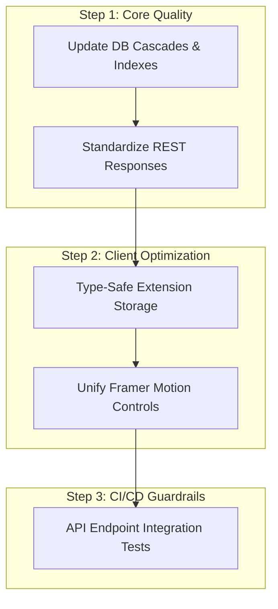

# Refactoring Plan

## 1. Goal & Strategy
This refactoring plan aims to address high-priority code quality issues to improve maintainability and performance across the monorepo, while preserving existing features and backward compatibility.

---

## 2. Targeted Refactoring Milestones

---

## 3. Detailed Action Items

### Refactoring DB Schema Cascades
- **Why it matters**: Deleting users or products can leave orphaned records in join tables, leading to database bloat and data inconsistencies.
- **Current Implementation**: Join tables like `WishlistItem` rely on application logic to handle cascades cleanly.
- **Proposed Refactoring**: Add cascading constraints (`onDelete: Cascade`) directly to foreign key relations in `schema.prisma`.
- **Impact**: Enforces database-level data integrity and simplifies service-level cleanup code.
- **Effort**: Low (1 day) | **Risk**: Low

### Standardizing REST Response Wrappers
- **Why it matters**: Some older routes return raw JSON instead of using our standardized response helpers, violating API consistency.
- **Current Implementation**: Endpoints like `apps/web/app/api/products/route.ts` return raw JSON structures.
- **Proposed Refactoring**: Refactor raw routes to use the unified `withApiHandler` middleware and return standardized `ApiResponse` objects.
- **Impact**: Guarantees a consistent response format (`{ success: true, data }`) across all API endpoints.
- **Effort**: Medium (2 days) | **Risk**: Medium

### Strengthening Extension Storage Type Constraints
- **Why it matters**: The extension storage layer uses loose type casting, which can lead to runtime bugs if storage schemas change.
- **Current Implementation**: `storage.ts` performs raw read/write operations without verifying schemas.
- **Proposed Refactoring**: Enforce Zod schemas from `@wishhub/contracts` during storage operations to validate data dynamically.
- **Impact**: Ensures type safety and prevents data corruption in client-side storage caches.
- **Effort**: Medium (2 days) | **Risk**: Medium
