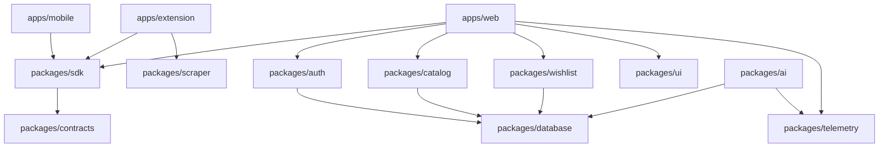

# Repository Audit

## 1. Monorepo Structural Blueprint
WishHub is organized as a Turborepo monorepo with explicit package scope separation under the `@wishhub` namespace. It uses `pnpm` workspace mapping for lock-file compilation and build-graph optimization.

```
/ (Root)
├── apps/
│   ├── web/               # Next.js 15 App Router & REST API
│   ├── extension/         # Vite-powered Browser Extension popup & worker
│   └── mobile/            # Expo React Native App
├── packages/
│   ├── ai/                # AI Providers (OpenAI, Mock) & summaries
│   ├── api-client/        # Client SDK hooks & state management
│   ├── auth/              # Better Auth initialization
│   ├── catalog/           # Products domain, services, & repository
│   ├── config/            # Monorepo build, lint, and TS configurations
│   ├── constants/         # Shared global constants
│   ├── contracts/         # Bidirectional Zod request/response schemas
│   ├── core/              # Domain primitives (Result, BaseEntity)
│   ├── database/          # Prisma database client & raw repository layers
│   ├── env/               # Environment variables verification (t3-env)
│   ├── feature-flags/     # Feature toggle parameters
│   ├── jobs/              # Background schedulers & cron processing
│   ├── notifications/     # Messaging pipelines
│   ├── real-time/         # Realtime sync primitives
│   ├── scraper/           # Page extraction core and adapters (Amazon, JSON-LD)
│   ├── sdk/               # Universal TS client wrapper
│   ├── storage/           # Supabase object storage upload helpers
│   ├── telemetry/         # Logging wrappers, metrics, and Console loggers
│   ├── types/             # Common model interfaces
│   ├── ui/                # Shared Tailwind styling and Radix elements
│   ├── utils/             # Core utility helpers
│   └── wishlist/          # Wishlist domain, services, and repositories
├── verification/          # Production Readiness Audit documentation
└── turbo.json             # Build orchestration graph configurations
```

---

## 2. Dependencies & Workspace Analysis
The workspaces resolve internal peer packages using relative semantic declarations (e.g., `"@wishhub/database": "workspace:*"`).



### High-Risk Monorepo Anti-Patterns
1. **Duplicate Dependency Versions**:
   - `packages/database` and `root` explicitly reference different `prisma` CLI and client version combinations (e.g., `^5.22.0`). All workspace peer dependencies must be locked to identical semver declarations.
2. **Vercel Dynamic Hydration Conflict**:
   - Web application `apps/web/package.json` contains independent packages that are web-only. Some workspace packages depend on node native modules that cannot run on Edge runtimes. This requires careful path isolation.

---

## 3. Build & Orchestration Graph
The Turborepo pipelines are mapped inside `turbo.json`.

```json
{
  "tasks": {
    "db:generate": {
      "cache": false
    },
    "build": {
      "dependsOn": ["db:generate", "^build"],
      "outputs": [".next/**", "dist/**"]
    },
    "lint": {
      "dependsOn": ["^lint"]
    },
    "typecheck": {
      "dependsOn": ["^typecheck"]
    }
  }
}
```

### Architectural Critique
- **`db:generate` cache omission**: The Prisma schema generation is correctly configured to run before any workspace compilation is attempted.
- **Vercel Build Hooks**: Build tasks on Vercel are correctly prioritized using `pnpm --filter @wishhub/database db:generate && next build`, avoiding runtime initialization faults.
